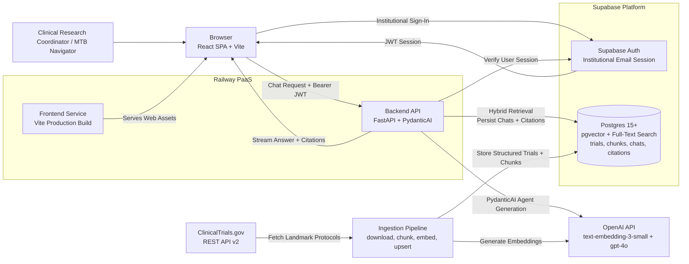
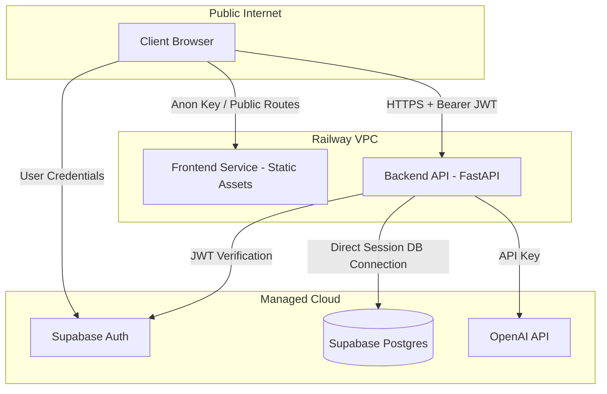
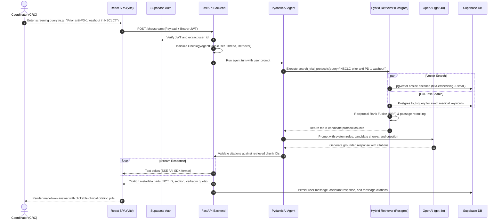
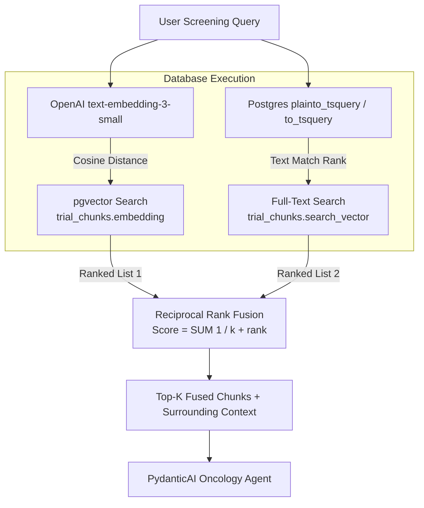
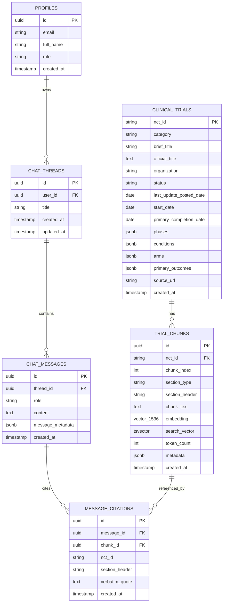
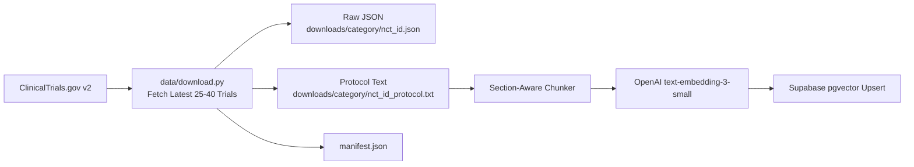

# Sarah Cannon Research Institute (SCRI) — Oncology Copilot Architecture

## 1. Purpose & Domain Context

**SCRI Oncology Copilot** is an enterprise clinical intelligence assistant designed specifically for **Sarah Cannon Research Institute (SCRI)**. Operating as the clinical research arm of HCA Healthcare across 250+ community cancer clinic sites, SCRI coordinates Phase 1–3 trials enrolling over 4,500 cancer patients annually.

Clinical Research Coordinators (CRCs), Molecular Tumor Board (MTB) navigators, and Principal Investigators (PIs) currently spend **15–20 hours per week** manually reviewing 100+ page clinical trial protocols to screen patients against intricate eligibility criteria:
- Prior therapy washout periods (e.g., checkpoint inhibitors, radiotherapy, chemotherapy)
- Biomarker requirements (*KRAS G12D*, *EGFR Exon 20*, *HER2-low*, *MSI-H / dMMR*)
- Laboratory thresholds (ANC, platelet count, Cockcroft-Gault CrCl, ALT/AST)
- Organ function limits and stable central nervous system (CNS) brain metastases intervals

The system optimizes for **uncompromising clinical trust**:
1. **Zero Hallucination / Absolute Grounding:** In oncology, a fabricated eligibility threshold is clinically dangerous. If a protocol does not state a criterion, the system explicitly declares: *"The protocol does not state [X]."*
2. **Mandatory Verbatim Citations:** Every factual claim must be backed by an inspectable citation to the specific **NCT ID**, section header, and paragraph (e.g., `[NCT07659782, Eligibility: Exclusion Criterion #4]`).
3. **One-Click Evidence Inspection:** Coordinators can verify the exact source protocol excerpt in the UI in seconds without opening a 200-page document.
4. **Zero PHI / HIPAA Exposure:** The system operates strictly on **unclassified clinical trial protocols** (public domain documents from ClinicalTrials.gov and sponsor regulatory binders), never on patient medical records (EHR/charts).

---

## 2. High-Level Architecture

The architecture separates the interactive clinical chat path from the protocol ingestion pipeline, maintaining a thin frontend and an authoritative, secure backend.



---

## 3. Architectural Goals & Core Principles

- **Thin Client:** The browser manages UI state, auth tokens, streaming rendering, and interactive citation popovers. It contains no retrieval logic or model keys.
- **Authoritative Backend:** FastAPI owns authorization, hybrid search execution, Reciprocal Rank Fusion (RRF), prompt assembly, PydanticAI orchestration, citation validation, and durable writes.
- **Unified Persistence:** Supabase Postgres serves as the single persistence layer for user identities, chat history, clinical trials, protocol text chunks, vector embeddings, and citation linkage.
- **Native Hybrid Search:** Leverages Postgres native capabilities—`pgvector` for semantic similarity and `to_tsvector` / `to_tsquery` for exact clinical terminology—fused via in-memory Reciprocal Rank Fusion (RRF).
- **Typed LLM Boundaries:** PydanticAI provides static typing across dependencies, prompts, and output structures (`GroundedAnswer`, `Citation`, `ProtocolPassage`), preventing schema drift.
- **Stream-Safe Citation Enforcement:** Assistant messages stream token deltas to the UI, followed by validated citation metadata parts that guarantee every cited passage exists in the retrieved set.

---

## 4. Technology Stack

| Layer | Technology | Selection Rationale |
| :--- | :--- | :--- |
| **Frontend Framework** | React 18+ / Vite / TypeScript (strict) | Ultra-fast client build, strict compile-time safety, zero SSR complexity |
| **Styling & Components** | Tailwind CSS + shadcn/ui | Clean, accessible clinical UI primitives with custom citation popovers |
| **Client Streaming** | Vercel AI SDK React primitives (`useChat`) | Battle-tested streaming response management and chat message state |
| **Backend Framework** | Python 3.12+ / FastAPI / Uvicorn | Async I/O by default, native Pydantic v2 validation, OpenAPI documentation |
| **Agent Orchestration** | PydanticAI | Typed dependencies, typed agent outputs, compile-time safety for LLM workflows |
| **Database & Vector Store** | Supabase Postgres (`pgvector`) | Integrated HNSW indexing, full-text search, connection pooling, and Row Level Security |
| **Schema & Migrations** | SQLAlchemy 2.0 + Alembic | Declarative schema definitions and auditable, version-controlled migrations |
| **Embeddings** | OpenAI `text-embedding-3-small` (1536-dim) | Cost-efficient, high-performance semantic representation for medical retrieval |
| **Primary LLM** | OpenAI `gpt-4o` | Superior medical reasoning, strict adherence to negative constraints (anti-hallucination) |
| **Authentication** | Supabase Auth | Institutional email sessions (`@scri.com`, `@hcahealthcare.com`), no social OAuth |
| **Hosting Platform** | Railway | Two containerized services (Frontend SPA + Backend API), automated deployment |

---

## 5. System Boundaries & Security Model



### Boundary Rules:
1. **Frontend Isolation:**
   * Holds only `VITE_SUPABASE_ANON_KEY` and `VITE_API_BASE_URL`.
   * Never possesses the Supabase `service_role` key or `OPENAI_API_KEY`.
   * Cannot directly execute vector queries or bypass backend authorization.
2. **Backend Authority:**
   * Validates the Supabase JWT on every non-public request (`HTTP 401` on invalid/expired tokens).
   * Enforces user tenancy: coordinators can only access chat threads they own (`HTTP 403` on access violations).
   * Holds all privileged service keys and direct database connection strings.
3. **Database Security:**
   * Row-Level Security (RLS) enabled on all personal data (`chat_threads`, `chat_messages`).
   * Unclassified clinical trial data (`clinical_trials`, `trial_chunks`) is globally readable by authenticated coordinators.

---

## 6. End-to-End Request & Screening Flow



---

## 7. Frontend Architecture (React + Vite SPA)

The frontend is an ultra-lean, responsive Single Page Application built with TypeScript, Tailwind CSS, and shadcn/ui. It communicates with FastAPI over Server-Sent Events (SSE) using the Vercel AI SDK client primitives.

### Directory Structure:
```text
frontend/src/
├── components/
│   ├── chat/
│   │   ├── ChatContainer.tsx        # Main coordinator chat interface
│   │   ├── ChatInput.tsx            # Prompt input with suggested oncology queries
│   │   ├── MessageList.tsx          # Virtualized message history stream
│   │   └── MessageItem.tsx          # Assistant/user bubble renderer
│   ├── citations/
│   │   ├── CitationBadge.tsx        # Clickable [NCT0XXXXXXX, Section] inline pill
│   │   ├── CitationPopover.tsx      # Hover/click card showing verbatim protocol excerpt
│   │   └── GroundingStatus.tsx      # Visual indicator confirming 100% verified evidence
│   ├── trials/
│   │   ├── TrialCard.tsx            # Protocol summary (Status, Phase, Conditions, Arms)
│   │   └── ProtocolDrawer.tsx       # Slide-out full protocol document viewer
│   └── ui/                          # shadcn/ui primitives (Dialog, Popover, Badge, Button)
├── lib/
│   ├── api.ts                       # Backend API client for threads and trials
│   ├── env.ts                       # Single source of truth for VITE_* environment variables
│   ├── http.ts                      # Fetch wrapper with auto-injected Bearer token
│   └── supabase.ts                  # Browser Supabase auth client
├── pages/
│   ├── ChatPage.tsx                 # Primary screening interface
│   ├── HistoryPage.tsx              # Coordinator screening session history
│   └── TrialsPage.tsx               # Active trial catalog and disease program browser
├── App.tsx                          # React Router route definitions
└── main.tsx                         # App entrypoint & theme provider
```

### Citation UX Pattern:
When the coordinator reviews an answer, citations render as interactive clinical badges:
```tsx
// Example rendered badge
<CitationBadge
  nctId="NCT07659782"
  section="Eligibility: Exclusion Criterion #4"
  vintage="Updated Sep 2026"
  verbatimQuote="Prior anti-cancer Tx within 4 weeks or drug-specific timeline..."
/>
```
Clicking or hovering over the badge opens the verbatim text directly from the protocol chunk, allowing immediate confirmation without context switching.

---

## 8. Backend LLM & Agent Layer (FastAPI + PydanticAI)

The backend relies on **PydanticAI** to construct a deterministic, typed boundary around OpenAI's `gpt-4o`.

### Directory Structure:
```text
backend/app/
├── api/
│   ├── auth.py                      # Health and user session routes
│   ├── chat.py                      # POST /chat/stream and thread management
│   └── trials.py                    # Read-only trial metadata catalog endpoints
├── assistant/
│   ├── agent.py                     # PydanticAI Agent definition and system prompt
│   ├── deps.py                      # OncologyAgentDeps runtime dependency container
│   ├── outputs.py                   # GroundedAnswer, Citation, and SourcePassage schemas
│   └── prompts.py                   # Clinical system instructions and negative constraints
├── auth/
│   └── dependencies.py              # Supabase JWT extraction and user verification
├── config.py                        # Pydantic Settings (single source of truth for backend env)
├── database/
│   ├── models.py                    # SQLAlchemy declarative models (Alembic autogenerate)
│   ├── session.py                   # Async engine and direct connection sessions
│   ├── chats.py                     # Chat thread, message, and citation CRUD
│   └── trials.py                    # Trial and chunk queries
├── grounding/
│   └── validator.py                 # Enforces citation-to-chunk verification
└── retrieval/
    ├── embedder.py                  # text-embedding-3-small query encoder
    ├── queries.py                   # pgvector and tsquery raw SQL queries
    ├── fusion.py                    # Reciprocal Rank Fusion (RRF) implementation
    └── retriever.py                 # Hybrid retriever orchestrator
```

### Agent Dependencies & Schema Contracts:

```python
from dataclasses import dataclass
from pydantic import BaseModel, Field
from app.retrieval.retriever import HybridRetriever
from app.grounding.validator import GroundingValidator

@dataclass
class OncologyAgentDeps:
    user_id: str
    thread_id: str
    retriever: HybridRetriever
    validator: GroundingValidator

class Citation(BaseModel):
    nct_id: str = Field(description="The NCT ID of the trial, e.g. NCT07659782")
    section: str = Field(description="The exact section, e.g. Eligibility: Exclusion Criterion #8")
    verbatim_quote: str = Field(description="The exact verbatim text excerpt from the protocol chunk")
    chunk_id: str = Field(description="UUID of the retrieved chunk supporting this claim")

class GroundedAnswer(BaseModel):
    answer: str = Field(description="Markdown formatted clinical response")
    citations: list[Citation] = Field(default_factory=list)
    is_silent: bool = Field(
        default=False, 
        description="True if the protocols do not contain enough evidence to answer"
    )
```

### Clinical System Contract:
The agent system prompt enforces strict rules:
1. Base answers **only** on retrieved protocol chunks provided in context.
2. Every clinical assertion must include a corresponding `[NCT ID, Section]` reference.
3. If an exclusion criterion, lab limit, or washout interval is not explicitly documented in the retrieved text, state: *"The retrieved protocol(s) do not specify [X]."*
4. Never assume standard-of-care clinical practice or extrapolate from external medical knowledge.

---

## 9. Hybrid Retrieval Strategy

In oncology screening, pure vector search frequently misses exact alphanumeric clinical entities (e.g., *KRAS G12C*, *ANC < 1500*, *DLT*, *RECIST 1.1*, *Child-Pugh B*), while pure keyword search misses semantic concepts (*prior immunotherapy washout*, *organ impairment tolerance*, *asymptomatic brain metastases stability*).

The SCRI Oncology Copilot employs **Hybrid Retrieval with Reciprocal Rank Fusion (RRF)**:



### Reciprocal Rank Fusion (RRF) Formula:
For each document $d$ in the union of semantic and lexical results:
$$RRF(d) = \sum_{m \in \{semantic, lexical\}} \frac{1}{k + r_m(d)}$$
where $k = 60$ (smoothing constant) and $r_m(d)$ is the 1-based rank of document $d$ in system $m$.

---

## 10. Grounding & Citation Enforcement

Grounding is an active architectural gate, not an advisory suggestion to the LLM:

1. **Candidate Registration:** During retrieval, all candidate chunk IDs are registered in the request context.
2. **Citation Extraction:** When the model outputs a response, its citations are parsed into structured objects.
3. **Verification Gate:**
   - Every cited `chunk_id` must match a retrieved chunk in the current turn.
   - The cited `nct_id` must match the parent trial of that chunk.
   - The `verbatim_quote` must exist as a normalized substring within the source chunk text.
4. **Correction / Safe Failure:** If an ungrounded citation is detected, it is stripped or the turn safely states that the claim lacks verifiable source backing, preventing hallucinated thresholds from reaching coordinators.

---

## 11. Database Schema & Data Model

The database is managed via SQLAlchemy declarative models and versioned Alembic migrations targeting hosted Supabase Postgres.



### Specialized Postgres Indexes:
- **Vector Search:** HNSW index on `trial_chunks.embedding` using `vector_cosine_ops` (`m=16`, `ef_construction=64`).
- **Full-Text Search:** GIN index on `trial_chunks.search_vector` generated using the `'english'` dictionary.
- **Lookup Indexes:** B-tree indexes on `trial_chunks(nct_id)`, `trial_chunks(section_type)`, and `clinical_trials(category)`.

---

## 12. Ingestion & Protocol Chunking Pipeline

Protocol ingestion transforms raw ClinicalTrials.gov REST API v2 payloads into clinically partitioned vector and text chunks.



### Chunking Strategy:
Standard naive character splitting fractures numbered exclusion lists (e.g., separating *"Serum creatinine > 1.5x ULN"* from its condition). The ingestion pipeline applies **Section-Aware Chunking**:
1. **Header & Design Chunk:** Trial ID, Title, Sponsor, Phase, Dates, Arms, and Primary Outcomes.
2. **Brief Summary Chunk:** High-level rationale and mechanism of action.
3. **Inclusion Criteria Chunks:** Partitioned along numbered list boundaries (`1.`, `2.`, `*`), preserving full criterion clauses (maximum 500 tokens).
4. **Exclusion Criteria Chunks:** Partitioned specifically by clinical risk categories (cardiac, CNS, hematologic, prior therapies, washouts).
5. **Metadata Tagging:** Every chunk is tagged with `nct_id`, `category`, `section_type` (`ELIGIBILITY_INCLUSION`, `ELIGIBILITY_EXCLUSION`, `STUDY_DESIGN`), and `last_update_posted_date`.

---

## 13. Configuration Management

Both services maintain a single, fail-fast configuration module.

### Frontend (`frontend/src/lib/env.ts`):
```typescript
export const env = {
  apiBaseUrl: import.meta.env.VITE_API_BASE_URL,
  supabaseUrl: import.meta.env.VITE_SUPABASE_URL,
  supabaseAnonKey: import.meta.env.VITE_SUPABASE_ANON_KEY,
} as const;

// Validates on load; throws descriptive error if any key is missing
```

### Backend (`backend/app/config.py`):
```python
from pydantic_settings import BaseSettings

class Settings(BaseSettings):
    supabase_url: str
    supabase_anon_key: str
    supabase_service_role_key: str
    database_url: str
    openai_api_key: str
    embedding_model: str = "text-embedding-3-small"
    llm_model: str = "gpt-4o"
    allowed_origins: list[str] = ["http://localhost:5173"]

    class Config:
        env_file = ".env"

settings = Settings()
```

---

## 14. Deployment Topology (Railway & Supabase)

The production deployment runs on **Railway** with hosted **Supabase**:

- **Frontend Service:** Containerized Nginx serving the static Vite production bundle. Connects to the backend via public domain or Railway private networking.
- **Backend Service:** Containerized Python 3.12 running `uvicorn app.main:app --host 0.0.0.0 --port $PORT --workers 2`.
- **Database:** Supabase Managed Postgres (Session Mode port 5432 for Alembic migrations; Transaction Pooler port 6543 for stateless backend requests).

---

## 15. Implementation Sequence & Milestones

1. **Data Pipeline & Seeding:**
   - [x] Implement [data/download.py](file:///g:/My%20Drive/FarazAhmad-ai/projects/Sarah%20Cannon%20Research%20Institute%20%28SCRI%29/data/download.py) with ClinicalTrials.gov REST API v2 integration.
   - [x] Sort by `LastUpdatePostDate:desc` and extract rich dates, arms, and clinical endpoints.
   - [ ] Implement chunker and ingestion script to populate Supabase `clinical_trials` and `trial_chunks`.
2. **Backend Core & Database:**
   - [ ] Initialize SQLAlchemy models in `backend/app/database/models.py`.
   - [ ] Generate Alembic migrations for `pgvector`, HNSW indexes, full-text search, and chat tables.
   - [ ] Implement Supabase JWT bearer token verification dependency.
3. **Retrieval & PydanticAI Agent:**
   - [ ] Implement `pgvector` cosine similarity and Postgres `to_tsquery` searches.
   - [ ] Implement Reciprocal Rank Fusion (RRF) in `backend/app/retrieval/fusion.py`.
   - [ ] Implement PydanticAI oncology agent with typed `GroundedAnswer` output and strict negative constraints.
   - [ ] Implement citation validation in `backend/app/grounding/validator.py`.
4. **Streaming & Frontend Client:**
   - [ ] Implement `POST /chat/stream` SSE endpoint emitting AI SDK compliant parts.
   - [ ] Build React chat UI with Vercel AI SDK React primitives.
   - [ ] Build interactive clinical citation badge and popover components.
   - [ ] Build trial catalog and slide-out protocol drawer.
5. **Evaluation & Verification:**
   - [ ] Execute test suite of 10 coordinator oncology screening benchmark questions.
   - [ ] Verify 100% citation grounding and zero hallucinations on protocol silence tests.

---

## 16. Explicit Non-Goals

To maintain high architectural discipline and clinical safety, the following are explicitly out of scope:
- **No Patient Health Information (PHI) / EHR Parsing:** The system operates solely on public trial protocols, avoiding HIPAA and Epic write-access entanglements.
- **No Direct Browser-to-OpenAI Calls:** All LLM interactions are strictly brokered and validated by FastAPI.
- **No Multi-Agent Bloat:** A single, well-bounded PydanticAI agent with typed retrieval tools replaces complex multi-agent frameworks.
- **No Ad Hoc External Vector Databases:** `pgvector` inside Supabase Postgres eliminates distributed state synchronization issues.
- **No Uncontrolled Treatment Advice:** The system screens trial eligibility; it never provides independent medical diagnoses or prescription advice.
